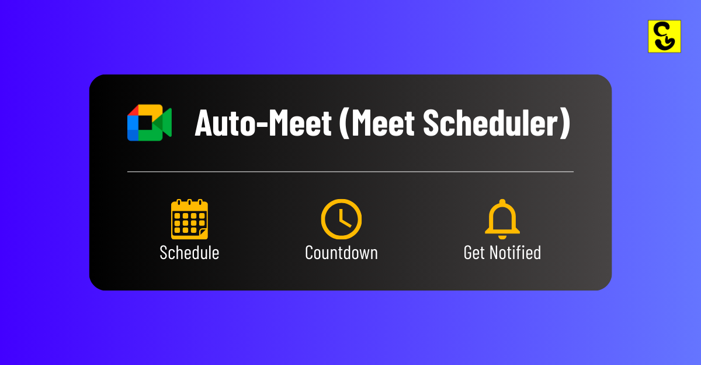
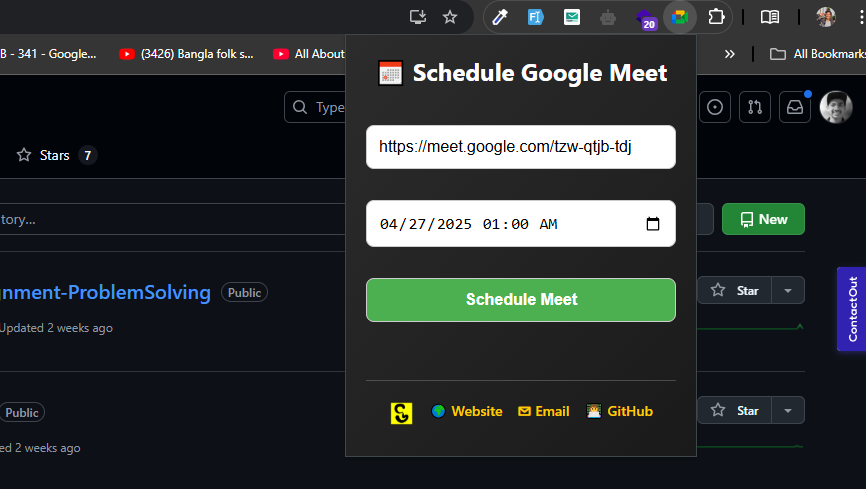
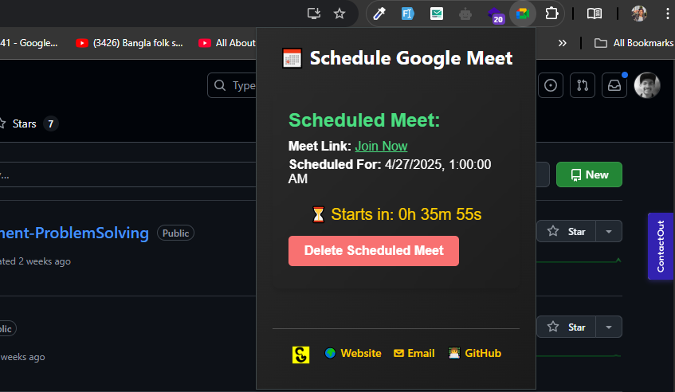

# 📅 Meet Scheduler - Chrome Extension

Easily schedule your online meetings and get notified when it's time to join!



---

## 🚀 Features

- Schedule any meeting link (Google Meet, Zoom, etc.)
- Shows a countdown timer until the meeting starts
- Chrome desktop notification when the meeting time is reached
- Click on the notification to directly open your meeting link
- Lightweight and easy to use

---

## 📥 Download Extension

[](https://drive.usercontent.google.com/uc?id=1h2zIc8XwQqnQem_cSdf_ze9mLYdy0Plw&export=download)

> ⚡ Upload it manually in your Chrome browser (instructions below).

---

## 🛠 Installation Guide

1. **Download** the extension ZIP file from the link above:
    ```bash
   https://drive.google.com/file/d/1h2zIc8XwQqnQem_cSdf_ze9mLYdy0Plw/view?usp=sharing
    ```

2. **Unzip** the folder (if downloaded as zip).

3. Open **Google Chrome** and go to:
    ```
    chrome://extensions/
    ```

4. Turn **Developer Mode** ON (top right corner).

5. Click **Load unpacked** and select the extracted extension folder.

6. 🎉 Done! Your Meet Scheduler extension is now ready to use.

---

## 📸 Screenshots

| Schedule a Meeting | Countdown Timer |
|:------------------:|:---------------:|
|  |  |

---

## ⚡ Tech Stack

- HTML5
- CSS3
- JavaScript (Vanilla)
- Chrome Extensions API (Manifest V3)

---

## 📝 License

This project is licensed under the [MIT License](LICENSE).

### Made with ❤️ by  
[Joy Chandra Uday](https://joychandrauday-nexus.vercel.app)  
[LinkedIn Profile](https://www.linkedin.com/in/joychandrauday)  
[GitHub Profile](https://github.com/joychandrauday)  

---